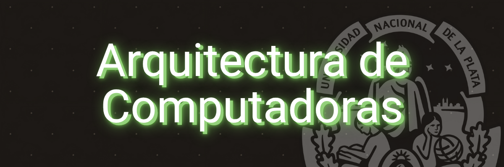

# Arquitectura-de-Computadoras-Informatica-UNLP

Este repositorio sirve de banco de apuntes personal y para uso pedagógico de quien lo desee, De resoluciones de los Trabajos Prácticos de la materia así como apuntes teóricos.
> [!WARNING]
> El material subido no busca reemplazar, ni reemplaza el material ofrecido por la cátedra, solo sirve como apoyo para con la materia para quien asi lo busque.

Aguante Assembly 😎

Material extra recomendado:
• Arquitectura de Computadoras UNLP
https://youtube.com/@arquitecturadecomputadoras505
• Joaquin Bogado
https://youtube.com/@joaquinbogado
• Genaro Camele
https://youtube.com/@genarocamele
• Kristian Bankoff
https://youtube.com/@ruskofulanito
